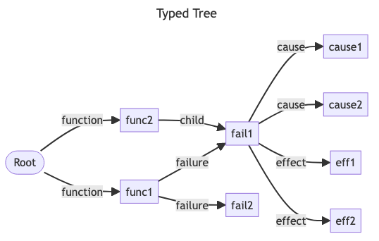
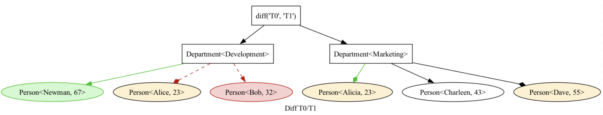
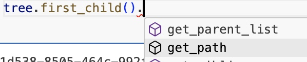
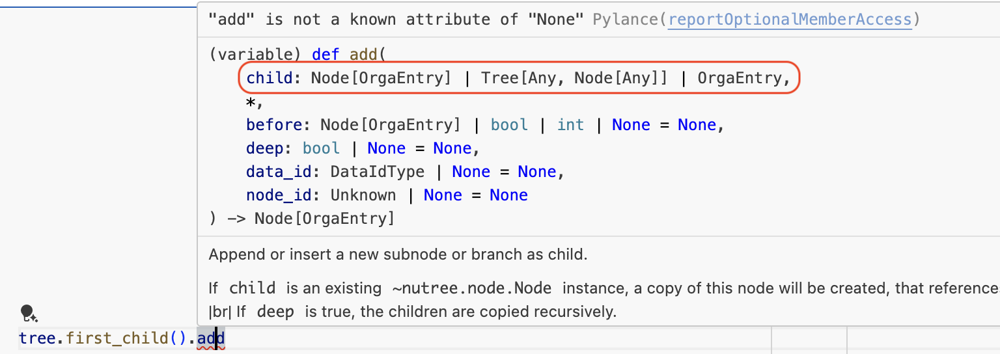
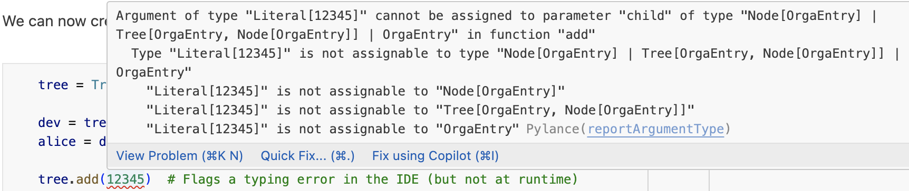

# Take the Tour

_(The tour is auto-generated from 
[this jupyter notebook](https://github.com/mar10/nutree/blob/main/docs/jupyter/take_the_tour.ipynb).)_

Nutree organizes arbitrary object instances in an unobtrusive way. <br>
That means, we can add existing objects without having to derive from a common 
base class or implement a specific protocol.


```python
from nutree import Tree

tree = Tree("Hello")
tree.add("N").add("u").up(2).add("T").add("r").up().add("ee")
tree.print()
```

    Tree<'Hello'>
    ├── 'N'
    │   ╰── 'u'
    ╰── 'T'
        ├── 'r'
        ╰── 'ee'


Strings can be directly added to a tree, but in a real-world scenario we want to 
handle ordinary objects:

## Set up some sample classes and objects
Let's define a simple class hierarchy


```python
import uuid


class Department:
    def __init__(self, name: str):
        self.guid = uuid.uuid4()
        self.name = name

    def __str__(self):
        return f"Department<{self.name}>"


class Person:
    def __init__(self, name: str, age: int):
        self.guid = uuid.uuid4()
        self.name = name
        self.age = age

    def __str__(self):
        return f"Person<{self.name} ({self.age})>"
```

and create some instances


```python
development_dep = Department("Development")
test__dep = Department("Test")
marketing_dep = Department("Marketing")

alice = Person("Alice", 25)
bob = Person("Bob", 35)
claire = Person("Claire", 45)
dave = Person("Dave", 55)
```

Now that we have a bunch of instances, let's organize these objects in a 
hierarchical structure using _nutree_:


```python
from nutree import Tree

tree = Tree("Organization")

dev_node = tree.add(development_dep)
test_node = dev_node.add(test__dep)
mkt_node = tree.add(marketing_dep)

tree.add(alice)
dev_node.add(bob)
test_node.add(claire)
mkt_node.add(dave)

tree.print()
```

    Tree<'Organization'>
    ├── <__main__.Department object at 0x118976c00>
    │   ├── <__main__.Department object at 0x1189778f0>
    │   │   ╰── <__main__.Person object at 0x118977ad0>
    │   ╰── <__main__.Person object at 0x1189776b0>
    ├── <__main__.Department object at 0x1189774d0>
    │   ╰── <__main__.Person object at 0x1189765a0>
    ╰── <__main__.Person object at 0x1189775c0>


Tree nodes store a reference to the object in the `node.data` attribute.

The nodes are formatted for display by the object's  `__repr__` implementation 
by default. <br>
We can overide this by passing an 
[f-string](https://docs.python.org/3/tutorial/inputoutput.html#formatted-string-literals) 
as `repr` argument. <br>
For example `"{node.data}"` will use the data instances `__str__` method instead:


```python
tree.print(repr="{node.data}")
```

    Tree<'Organization'>
    ├── Department<Development>
    │   ├── Department<Test>
    │   │   ╰── Person<Claire (45)>
    │   ╰── Person<Bob (35)>
    ├── Department<Marketing>
    │   ╰── Person<Dave (55)>
    ╰── Person<Alice (25)>


## Access Nodes
We can use the index syntax to get the node object for a given data object:


```python
tree[alice]
```


    Node<'Person<Alice (25)>', data_id=294221660>


We passed `alice` as index, which is an instance of `Person`, and received an 
instance of the `Node` container


```python
from nutree import Node

assert isinstance(tree[alice], Node)
assert tree[alice].data is alice, "nodes store objects in data attribute"
tree[alice].data
```


    <__main__.Person at 0x1189775c0>


**💡 Note** <br>
Even though we did not modify our objects to support a parent/child relationship,
we can use the tree container to achieve this:


```python
# tree[alice].parent.data
tree[alice].get_siblings()
```


    [Node<'Department<Development>', data_id=294221504>,
     Node<'Department<Marketing>', data_id=294221645>]


There are other other search methods as well


```python
tree.find_all(match=lambda node: "i" in node.data.name)
```


    [Node<'Person<Claire (45)>', data_id=294221741>,
     Node<'Department<Marketing>', data_id=294221645>,
     Node<'Person<Alice (25)>', data_id=294221660>]


### Control the `data_id`

If the object instances have an attribute that naturally identifies them, 
we can use it instead of the default `hash()`. <br>
This improves readability and may be more appropriate for serialization:


```python
tree_2 = Tree("Organization", calc_data_id=lambda tree, data: str(data.guid))

dep_node_2 = tree_2.add(development_dep)
dep_node_2.add(bob)

tree_2.print(repr="{node}")
```

    Tree<'Organization'>
    ╰── Node<'Department<Development>', data_id=d04da003-e439-4ceb-b8a5-13b6af342c14>
        ╰── Node<'Person<Bob (35)>', data_id=2d64c47b-5a10-4513-ac4f-b7ed7c8bac49>


now we could also search by the GUID, for example:


```python
tree_2.find(data_id=str(bob.guid))
```


    Node<'Person<Bob (35)>', data_id=2d64c47b-5a10-4513-ac4f-b7ed7c8bac49>


## Iteration and Searching

There are multiple methods to iterate the tree.


```python
res = []
for node in tree:  # depth-first, pre-order traversal
    res.append(node.data.name)
print(res)
```

    ['Development', 'Test', 'Claire', 'Bob', 'Marketing', 'Dave', 'Alice']


```python
from nutree import IterMethod

res = []
for node in tree.iterator(method=IterMethod.POST_ORDER):
    res.append(node.data.name)
print(res)
```

    ['Claire', 'Test', 'Bob', 'Development', 'Dave', 'Marketing', 'Alice']


```python
def callback(node, memo):
    print(node.data.name, end=", ")


tree.visit(callback, method=IterMethod.LEVEL_ORDER)
```

    Development, Marketing, Alice, Test, Bob, Dave, Claire, 

The above traversal methods are also available for single nodes:


```python
res = [node.data.name for node in dev_node]
print(res)
```

    ['Test', 'Claire', 'Bob']


## Filter

We can create a filtered copy like so:


```python
tree_copy = tree.filtered(lambda node: isinstance(node.data, Department))
tree_copy.print(repr="{node}")
```

    Tree<"Copy of Tree<'Organization'>">
    ├── Node<'Department<Development>', data_id=294221504>
    │   ╰── Node<'Department<Test>', data_id=294221711>
    ╰── Node<'Department<Marketing>', data_id=294221645>


In-place filtering is also available:


```python
tree_copy.filter(lambda node: "m" in node.data.name.lower())
tree_copy.print(repr="{node}")
```

    Tree<"Copy of Tree<'Organization'>">
    ├── Node<'Department<Development>', data_id=294221504>
    ╰── Node<'Department<Marketing>', data_id=294221645>


## Mutation

We can add, copy, move, remove, sort, &hellip; nodes.

For example:


```python
alice_node = tree[alice]
bob_node = tree[bob]

bob_node.move_to(mkt_node)
alice_node.copy_to(dev_node)

tree.print(repr="{node.data}")
```

    Tree<'Organization'>
    ├── Department<Development>
    │   ├── Department<Test>
    │   │   ╰── Person<Claire (45)>
    │   ╰── Person<Alice (25)>
    ├── Department<Marketing>
    │   ├── Person<Dave (55)>
    │   ╰── Person<Bob (35)>
    ╰── Person<Alice (25)>


Read the [user guide](https://nutree.readthedocs.io/en/latest/ug_mutation.html) 
for more ways to modify a tree.

## Data IDs and Clones

In the example above, we duplicated the 'Alice' node, so we now have two 
node instances that reference the same data object, as we can see from the
identical data_id:


```python
tree.print(repr="{node}", title=False)
```

    Node<'Department<Development>', data_id=294221504>
    ├── Node<'Department<Test>', data_id=294221711>
    │   ╰── Node<'Person<Claire (45)>', data_id=294221741>
    ╰── Node<'Person<Alice (25)>', data_id=294221660>
    Node<'Department<Marketing>', data_id=294221645>
    ├── Node<'Person<Dave (55)>', data_id=294221402>
    ╰── Node<'Person<Bob (35)>', data_id=294221675>
    Node<'Person<Alice (25)>', data_id=294221660>


```python
for clone in tree.find_all(alice):
    print(f"{clone}, parent={clone.parent}")
```

    Node<'Person<Alice (25)>', data_id=294221660>, parent=None
    Node<'Person<Alice (25)>', data_id=294221660>, parent=Node<'Department<Development>', data_id=294221504>


## Special Data Types
### Plain Strings

Plain strings are hashable objects, so we can handle them the same way as any 
other object:


```python
tree_str = Tree()
a = tree_str.add("A")
a.add("a1")
a.add("a2")
tree_str.add("B")
tree_str.print()
```

    Tree<'4707573280'>
    ├── 'A'
    │   ├── 'a1'
    │   ╰── 'a2'
    ╰── 'B'


### Dictionaries

We cannot add Python `dict` objects to a tree, because nutree cannot derive
a *data_id* for unhashable types. <br>
We can handle this by passing a *data_id* explicitly to `add()` and similar 
methods, or implement a `calc_data_id` callback as shown before.

As another workaround, we can wrap it inside `DictWrapper` objects:


```python
from nutree import DictWrapper, Tree

d = {"title": "foo", "id": 1}

tree = Tree()
tree.add("A").up().add("B")
tree["A"].add(DictWrapper(d))
tree["B"].add(DictWrapper(d))
tree.print(repr="{node}")
# tree.find(d)
```

    Tree<'4707574048'>
    ├── Node<'A', data_id=-1299945154458204803>
    │   ╰── Node<"DictWrapper<{'title': 'foo', 'id': 1}>", data_id=4713963904>
    ╰── Node<'B', data_id=1584232329632515111>
        ╰── Node<"DictWrapper<{'title': 'foo', 'id': 1}>", data_id=4713963904>


## Typed Trees

The `TypedTree` subclass adds a 'kind' attribute to the nodes, and related 
methods. <br>
This allows to organize objects in directed graphs:


```python
from nutree import TypedTree

typed_tree = TypedTree()
typed_tree.add("Mia", kind="friend").add("Noah", kind="brother").up().add(
    "Olivia", kind="sister"
)
typed_tree.print()
```

    TypedTree<'4707548432'>
    ╰── friend → Mia
        ├── brother → Noah
        ╰── sister → Olivia


## Serialization

Nutree supports save/load in a compact native JSON format as well as 
ZIP, RDF, DOT, and mermaid. <br>
Even conversion to and SVG, PNG is possible:



Read the [User Guide](https://nutree.readthedocs.io/en/latest/ug_serialize.html) 
for different methods to save, load, or convert a tree to different output formats.


## Diff

Given two trees, for example

```
Tree<'T0'>
├── Node<'Department<Development>', data_id={012-345}>
│   ├── Node<'Person<Alice, 23>', data_id={123-456}>
│   ╰── Node<'Person<Bob, 32>', data_id={234-456}>
╰── Node<'Department<Marketing>', data_id={012-456}>
    ├── Node<'Person<Charleen, 43>', data_id={345-456}>
    ╰── Node<'Person<Dave, 54>', data_id={456-456}>

Tree<'T1'>
├── Node<'Department<Development>', data_id={012-345}>
│   ╰── Node<'Person<Newman, 67>', data_id={567-567}>
╰── Node<'Department<Marketing>', data_id={012-456}>
    ├── Node<'Person<Alicia, 23>', data_id={123-456}>
    ├── Node<'Person<Charleen, 43>', data_id={345-456}>
    ╰── Node<'Person<Dave, 55>', data_id={456-456}>
```

We can generate a merged tree with additional annotations:

```py
tree_2 = tree_0.diff(tree_1, compare=True, reduce=False)
tree_2.print(repr=diff_node_formatter)
```

```
Tree<"diff('T0', 'T1')">
├── Department<Development>
│   ├── Person<Newman, 67> - [Added]
│   ├── Person<Alice, 23> - [Moved away]
│   ╰── Person<Bob, 32> - [Removed]
╰── Department<Marketing>
    ├── Person<Alicia, 23> - [Moved here], [Modified]
    ├── Person<Charleen, 43>
    ╰── Person<Dave, 54> - [Modified]
```

It is also possible to visualize as png, for example:
```py
tree_2.to_dotfile("tree_diff.png", format="png", ...)
```



## Type Hints

Nutree comes fully typed (passing [pyright](https://microsoft.github.io/pyright/#/) 
standard checks). This improves type-safety and auto-complete features inside 
IDEs.

Assuming we have a hierrchy of objects:


```python
class OrgaEntry:
    def __init__(self, name: str):
        self.name: str = name
        self.guid = uuid.uuid4()


class Person(OrgaEntry):
    def __init__(self, name: str, age: int):
        super().__init__(name)
        self.age: int = age


class Department(OrgaEntry):
    def __init__(self, name: str):
        super().__init__(name)
```

We can now create a type-safe tree to store these objects:


```python
tree = Tree[OrgaEntry]()

dev = tree.add(Department("Development"))
alice = dev.add(Person("Alice", 25))

tree.add(12345)  # Flags a typing error in the IDE (but not at runtime)

# IDE infers that the type `OrgaEntry` is stored in the `data` attribute
# and provides code completion
print(alice.data.guid)
```

    abf42a2b-e96f-4a71-8312-4688e6d0c5b1


Note that the IDE can now **make better suggestions**



**display type info**



and **detect type errors**:


