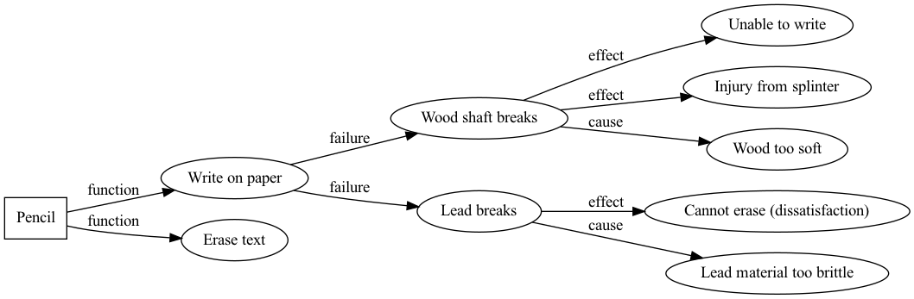
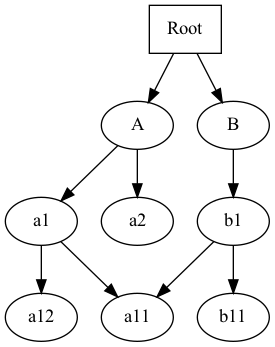
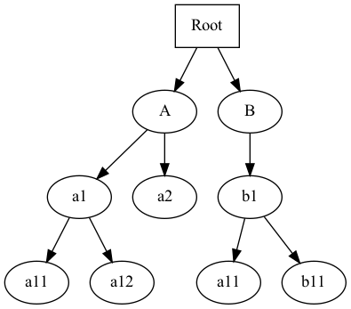
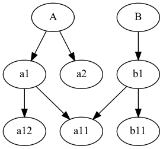
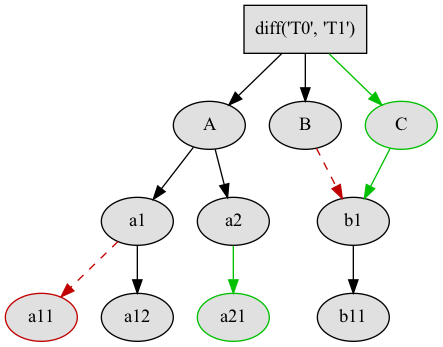

------
Graphs
------

.. py:currentmodule:: nutree

.. note::
    :class:`~nutree.tree.Tree` (and :class:`~nutree.typed_tree.TypedTree` even 
    more so) have features that make mapping to a graph easy. 
    However it still is a `tree` at heart. |br|
    If you are looking for a data model with full graph support, links between 
    arbitrary nodes, advanced navigation methods, or SPARQL queries,have a look
    at specialzed libraries,such as `rdflib <https://github.com/RDFLib/rdflib>`_ .

In graph theory, :class:`~nutree.tree.Tree` is a 
`Rooted Tree <https://en.wikipedia.org/wiki/Tree_(graph_theory)#Rooted_tree>`_
which is a subform of a
`Directed Graph <https://en.wikipedia.org/wiki/Directed_graph>`_
(aka `digraph`). |br|
Accordingly every tree can be visualized in a graph diagram:

- Every tree node becomes a graph node |br|
  `Exception`: tree nodes with identical data (aka 'clones') map to one single 
  graph node.
- Parent- and child nodes are connected by an arrow (aka 'edge') pointing from 
  parent to child, meaning 'is child of'.

While every tree is a digraph, not every digraph can be directly represented 
as tree, because `arbitrary` directed graphs 

1. may contain closed circles (i.e. the graph is not 'acyclic')
2. may have loops (arrows that directly connect nodes to themselves), which
   is a special case of 1.)
3. may have multiple arrows with same source and target nodes
4. may not have an obvious root node (i.e. the graph is not 'rooted')
5. may have nodes that are the target of more than one arrow
6. may have other edge semantics than 'is child of'

As a consequence

1. Graphs with circles would result in trees of infinite depth. We stop adding 
   a child node if it already appears as its own ancestor.
2. See 1.): we do not allow to add a tree node as child of itself.
3. We do not allow to add the same tree node a second time under one parent.
4. We pick the first tree node, or search for a good candidate using heuristics.
5. A graph node that is target of multiple arrows is added to the tree multiple
   times. Each of thoses tree nodes ('clones') reference the identical data 
   object.
6. The :class:`~nutree.typed_tree.TypedTree` class handles this.
   See below for details.

Typed Tree
----------

The :class:`~nutree.typed_tree.TypedTree` class is a variant derived from
:class:`~nutree.tree.Tree` that introduces the concept of `typed nodes`. |br|
It adds a new ``node.kind`` attribute and modifies some methods to access 
children by that type. |br|
In a nutshell: `TypedTree nodes can have multiple types of children.`

Main differences to plain `Tree`:

    - Uses :class:`~nutree.typed_tree.TypedNode` that adds an additional 
      ``node.kind`` attribute.
    - The kind is part of the display name by default:
      ``repr="{node.kind} → {node.data}"``, e.g. 'person → Alice'.
    - Node methods like :meth:`~nutree.typed_tree.TypedNode.children()` get
      an additional mandatory argument ``kind`` to filter by type.s
      Pass ``kind=ANY_TYPE`` to retrieve all children.
    - Node methods like :meth:`~nutree.typed_tree.TypedNode.get_index()` 
      assume get '... of the same type'. An additional argument ``any_type=True`` 
      can be passed to ignore the types.
    - Node properties like :meth:`~nutree.typed_tree.TypedNode.first_sibling`
      implicitly assume '... of the same type'.
    - When converting to a graph, `node.kind` becomes the label of the arrow
      pointing from the parent to this node.

Note:

    - Methods like :meth:`~nutree.typed_tree.TypedNode.iter` still access all 
      nodes, ignoring the types.

When adding nodes, we now pass this type, e.g.::

    tree = TypedTree("Pencil")

    func = tree.add("Write on paper", kind="function")
    fail = func.add("Wood shaft breaks", kind="failure")
    fail.add("Unable to write", kind="effect")
    fail.add("Injury from splinter", kind="effect")
    fail.add("Wood too soft", kind="cause")

    fail = func.add("Lead breaks", kind="failure")
    fail.add("Cannot erase (dissatisfaction)", kind="effect")
    fail.add("Lead material too brittle", kind="cause")

    func = tree.add("Erase text", kind="function")
    ...
    tree.print()

::

    TypedTree<Pencil>
    +- function → Write on paper
    |  +- failure → Wood shaft breaks
    |  |  +- effect → Unable to write
    |  |  +- effect → Injury from splinter
    |  |  `- cause → Wood too soft
    |  `- failure → Lead breaks
    |     +- effect → Cannot erase (dissatisfaction)
    |     `- cause → Lead material too brittle
    `- function → Erase text

The effect becomes evident when we map a tree to a graph representation. It is
now possible to define labelled edges::

    tree.to_dotfile(
        "/path/tree.png",
        format="png",
        graph_attrs={"rankdir": "LR"},
    )

Keep in mind that a tree node is unique within a tree, but may reference identical
data objects, so these `clones` could exist at different locations of tree:
for example 'friends → Alice', and 'friends → Alice'.

.. note::
    :class:`~nutree.typed_tree.TypedTree`'s node type only affects 
    parent → child relations. Arbitrary links are not supported.
    If you are looking for a data model with full graph support have a look
    at specialzed libraries,such as `rdflib <https://github.com/RDFLib/rdflib>`_.

.. rubric:: Writing Digraphs

DOT Format
----------

Nutree implements conversion to `DOT format <https://en.wikipedia.org/wiki/DOT_(graph_description_language)>`_.
Given this tree ::

    Tree<'Root'>
    ├── 'A'
    │   ├── 'a1'
    │   │   ├── 'a11'
    │   │   ╰── 'a12'
    │   ╰── 'a2'
    ╰── 'B'
        ╰── 'b1'
            ├── 'a11'  <- second occurence
            ╰── 'b11'

we can write a DOT formatted file like so::

    tree.to_dotfile("graph.gv")

::

    digraph Root {
        // Node definitions
        __root__ [label="Root" shape="box"]
        -2117698517398243110 [label="A"]
        8696834500465194416 [label="a1"]
        3848329043807418154 [label="a11"]
        -8723831530700312132 [label="a12"]
        -1180776893324476219 [label="a2"]
        8369695036033697218 [label="B"]
        1739272887205481547 [label="b1"]
        -1397849070657872512 [label="b11"]

        // Edge definitions
        __root__ -> -2117698517398243110
        -2117698517398243110 -> 8696834500465194416
        8696834500465194416 -> 3848329043807418154
        8696834500465194416 -> -8723831530700312132
        -2117698517398243110 -> -1180776893324476219
        __root__ -> 8369695036033697218
        8369695036033697218 -> 1739272887205481547
        1739272887205481547 -> 3848329043807418154
        1739272887205481547 -> -1397849070657872512
    }

This DOT graph may be rendered in different formats like so::

    tree.to_dotfile("tree_graph.png", format="png")

Note that in the previous image, the `clone` tree node "a11" is represented 
as a single graph node.
Separate nodes can be created by passing the ``unique_nodes=False`` argument::

    tree.to_dotfile("graph.png", format="png", unique_nodes=False)

Pass the ``add_root=False`` argument to remove the root node::

    tree.to_dotfile("graph.png", format="png", add_root=False)

The DOT output can be customized with default attribute definitions by passing 
the `graph_attrs`, `node_attrs`, and `edge_attrs` arguments. |br|
In addition, the default attributes can be overriden per node and edge by passing 
mapper callbacks.
See also `list of available attributes <https://graphviz.org/doc/info/attrs.html>`_.

Let's visualize the result of the :ref:`Diff and Merge` example::

    tree_2 = tree_0.diff(tree_1)

    def node_mapper(node: Node, attr_def: dict):
        dc = node.get_meta("dc")
        if dc == DiffClassification.ADDED:
            attr_def["color"] = "#00c000"
        elif dc == DiffClassification.REMOVED:
            attr_def["color"] = "#c00000"

    def edge_mapper(node: Node, attr_def: dict):
        dc = node.get_meta("dc")
        if dc in (DiffClassification.ADDED, DiffClassification.MOVED_HERE):
            attr_def["color"] = "#00C000"
        elif dc in (DiffClassification.REMOVED, DiffClassification.MOVED_TO):
            attr_def["style"] = "dashed"
            attr_def["color"] = "#C00000"

    tree_2.to_dotfile(
        "result.png",
        format="png",
        graph_attrs={},
        node_attrs={"style": "filled", "fillcolor": "#e0e0e0"},
        edge_attrs={},
        node_mapper=node_mapper,
        edge_mapper=edge_mapper,
    )

.. note::
    Writing of plain DOT formats is natively implemented by `nutree`. |br|
    Rendering of output formats like `png`, `svg`, etc. requires an installation
    of `pydot <https://github.com/pydot/pydot>`_ 
    and `Graphwiz <https://www.graphviz.org>`_.

..
    .. rubric:: Reading Digraphs

    .. note:: Reading of DOT files is not yet implemented.

    .. note::
        Writing of plain DOT formats is natively implemented by `nutree`. |br|
        Reading of DOT formats requires the 
        `pydot <https://github.com/pydot/pydot>`_ library to be installed. |br|
